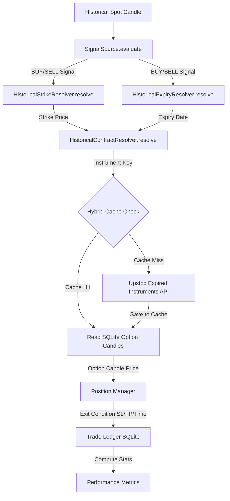
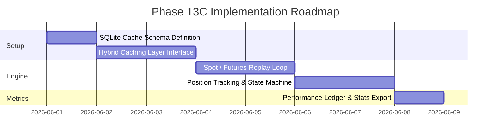

# Valkyrie V2 Option Backtest Engine
## Historical Data Source & Replay Feasibility Audit

This document reviews the historical data architecture for the V2 Option Backtest Engine. It determines how the system can obtain historical option premium data at scale while respecting API rate limits, storage costs, and execution speed.

---

## 1. Current Historical Data Architecture Audit

An audit of the existing Valkyrie codebase (`backend/app.py` and `backend/database.py`) reveals the following components:

*   **Existing Historical Candle Loaders**:
    *   `fetch_historical_candles(instrument_key, interval, from_date, to_date)` is implemented in `backend/app.py`.
    *   It executes HTTP GET requests to `https://api.upstox.com/v2/historical-candle/{encoded_key}/{interval}/{to_date}/{from_date}`.
    *   If an expired or invalid option instrument key is supplied, Upstox API responds with an error (`UDAPI100011`). The loader intercepts this and raises an exception: `"Option contract is expired or invalid. Historical candles not supported for expired contracts."`
    *   *Conclusion*: The current V1 loader is incapable of fetching expired derivative contracts.
*   **Existing Option Data Loaders**:
    *   No historical options data loader exists. Live options contract retrieval is handled via `/api/instruments` and `/api/strikes` endpoints which only query active, unexpired options contracts.
*   **Existing Instrument Resolution**:
    *   V2 implements `HistoricalContractResolver` and `ContractMasterCache` loading from `nifty_options.csv` to resolve active and near-term option contracts.
*   **Existing CSV/Parquet Storage**:
    *   `all_instruments.csv` (28.3 MB) containing active Upstox instruments.
    *   `nifty_options.csv` (1.7 MB) containing a snapshot of active option instrument keys.
    *   No Parquet or binary columnar storage is implemented.
*   **Existing Caching Mechanisms**:
    *   None. Every candle request hits the live Upstox REST API.
*   **Existing Database Usage**:
    *   SQLite database `valkyrie_trades.db` is utilized. It stores:
        *   `trade_sessions`: Session records, start times, initial balances, and final balances.
        *   `trade_logs`: Detailed trade log entries (entry price, stop loss, targets, P&L, timestamps).

---

## 2. Upstox Historical Derivative API Capabilities

Upstox provides historical data for expired derivative contracts (Futures and Options) under the **Upstox Plus** plan. The technical specifications of these endpoints are analyzed below:

### A. API Endpoints for Expired Instruments
1.  **Get Expired Expiries**:
    `GET https://api.upstox.com/v2/expired-instruments/expiry/{instrument_name}`
2.  **Get Expired Contracts**:
    `GET https://api.upstox.com/v2/expired-instruments/contracts/{instrument_name}/{expiry}`
3.  **Get Expired Historical Candles**:
    `GET https://api.upstox.com/v2/expired-instruments/historical-candle/{expired_instrument_key}/{interval}/{to_date}/{from_date}`

### B. Capabilities and Limits
*   **Timeframe Granularity**: Supports `1minute`, `3minute`, `5minute`, `15minute`, `30minute`, and `day` intervals.
*   **Rate Limits**:
    *   Upstox enforces a rate limit of **50 requests per second** and **500 requests per minute** on historical and market data APIs.
*   **Data Retention**:
    *   Intraday data (1-minute and custom minute intervals) is available from **January 2022** onwards.
    *   Daily data is available from **January 2000** onwards.
*   **Pagination Limits**:
    *   Queries for 1-minute historical candles return a maximum of a few weeks of data per request, requiring pagination for longer backtest durations.

---

## 3. Replay Requirements and Feasibility Estimation

To evaluate the feasibility of direct Upstox API usage, we estimate the API calls required for a standard backtesting run:

### Scenario Parameters
*   **Underlying Asset**: NIFTY Index
*   **Backtest Period**: 1 Year (approx. 250 trading days)
*   **Timeframe**: 5 Minutes
*   **Option Selection**: ATM Strike, Nearest Weekly Expiry
*   **Strategy**: 9/21 EMA Cross

### Operational Metrics Estimation

*   **Underlying Candles**: 250 days $\times$ 75 candles/day = **18,750 candles**
*   **Expected Signals / Trades**: ~2 signals per day = **500 trades/year**
*   **Contract Resolutions**: 1 resolution per signal = **500 resolutions**
*   **Premium Candle Lookups (holding period)**:
    *   Assuming an average trade duration of 10 candles (50 minutes), the engine needs to evaluate the option premium price for 10 distinct timestamps per trade.
    *   Total Lookups: 500 trades $\times$ 10 candles = **5,000 premium candle checkpoints**
*   **API Calls for Direct Upstox Replay**:
    *   1 API call to load the underlying Spot candles.
    *   500 API calls to retrieve the premium history for each of the 500 options contracts (querying the exact entry-to-exit window).
    *   *Total API Calls*: **501 calls**

### Feasibility Conclusion
Direct Upstox API replay is **highly impractical** for the following reasons:
1.  **Optimization Bottlenecks**: Running a parameter sweep (e.g. testing 100 combinations of EMA lengths) would require $500 \times 100 = 50,000$ API calls. At 500 requests/minute, a single sweep would take **1.6 hours** just in API network latency, rendering optimization impossible.
2.  **Strike Selection Costs**: If the strategy needs to check option chain premiums *before* entering (e.g. evaluating bid-ask spreads of multiple strikes to determine liquidity), the number of API calls scales exponentially.

---

## 4. Architectural Tradeoff Matrix

We compare five potential data storage and retrieval models for the backtest engine:

| Metric | Option A: Live API Retrieval | Option B: Local CSV Cache | Option C: SQLite Store | Option D: Parquet Data Lake | Option E: Hybrid Cache (SQLite + API) |
| :--- | :--- | :--- | :--- | :--- | :--- |
| **Speed** | Extremely Slow (~100ms/call) | Medium (slow parsing) | Fast (indexed lookups) | Extremely Fast (vectorized) | **Extremely Fast** (RAM/DB hits) |
| **Scalability**| Very Poor (rate-limited) | Poor (file management) | Excellent (millions of rows) | Outstanding (terabytes) | **Excellent** (grows dynamically) |
| **Complexity** | Low | Low | Medium | High | **Medium-High** |
| **Storage Cost**| Zero | Medium (text size) | Low-Medium (compact SQL) | Very Low (compression) | **Low** (only caches traded keys) |
| **Accuracy** | High | High | High | High | **High** |
| **Operational**| High (account risk) | Medium (manual sync) | Low (single DB file) | Medium (partition layout) | **Low** (automated caching) |

---

## 5. Recommended Architecture: Option E (Hybrid Cache with SQLite)

We recommend a **Hybrid Cache Architecture** backed by a local SQLite cache database: `valkyrie_options_cache.db`.

```
                  +-----------------------------------+
                  |        Backtest Engine            |
                  +-----------------------------------+
                                    |
                       [ Request Premium Candles ]
                                    v
                  +-----------------------------------+
                  |           Hybrid Cache            |
                  +-----------------------------------+
                               /         \
                      (Cache Hit)       (Cache Miss)
                             /             \
                            v               v
                +-----------------+   +-------------------------+
                |     SQLite      |   |   Upstox Expired API    |
                |  Options Cache  |   | (Fetch via Upstox Plus) |
                +-----------------+   +-------------------------+
                                                    |
                                            [ Write to SQLite ]
```

### Architectural Sublayers
1.  **Historical Spot Data Layer**: Reads index Spot candles (e.g. `NSE_INDEX|Nifty 50`) from cache, falling back to Upstox API on miss.
2.  **Historical Expiry Layer**: Plugs into `ExpiryCalendarProvider` to dynamically resolve weekly/monthly expiries.
3.  **Historical Contract Layer**: Uses the preloaded `ContractMasterCache` to find options symbols.
4.  **Historical Premium Layer**: Retrieves premium candles from `valkyrie_options_cache.db` at $O(1)$ speed.
5.  **Caching Layer**: SQLite engine managing table structures and key-value lookups.
6.  **Replay Engine Layer**: Vectorized event-driven loop processing candles and updating the position state machine.
7.  **Metrics Layer**: Formulates stats (Win Rate, Profit Factor, Sharpe Ratio, Max Drawdown).
8.  **Trade Ledger Layer**: Writes results to `valkyrie_trades.db` to feed the frontend telemetry dashboard.

---

## 6. End-to-End Production Data Flow



---

## 7. Storage and Sync Requirements Estimate

If we were to cache the **entire** option chain for the major Indian indices:
*   **Scope**: 4 Indices (NIFTY, BANKNIFTY, FINNIFTY, SENSEX)
*   **Timeframe**: 1 Year
*   **Volume**: ~100 strikes per index, CE & PE (200 contracts per index).
*   **Calculations**:
    *   Total contracts: 4 indices $\times$ 200 contracts = 800 contracts.
    *   Trading Minutes: 250 days $\times$ 375 minutes = 93,750 minutes/contract.
    *   Total Rows: $800 \times 93,750 = \mathbf{75,000,000 \text{ rows}}$.
    *   **Disk Size (SQLite)**: ~3.7 GB (assuming uncompressed index tables).
    *   **Download Time (via API)**: Preloading 75 million rows at 500 requests/minute would require 6.6 hours of continuous, error-free API downloads.

### **The Hybrid Caching Advantage**
By utilizing the **Hybrid Caching** strategy:
*   We do not cache the entire option chain. We only fetch and cache option contracts that are **actively traded** by the strategy (e.g. 500 contracts per year).
*   **Disk Footprint**: Less than **15 MB** per year of backtest data.
*   **Download Time**: Under **1 minute** on the first run; **0 seconds** on subsequent runs.

---

## 8. Implementation Roadmap for Phase 13C

We propose the following roadmap for Phase 13C:



### Key Risks and Mitigations
1.  **Upstox Plus Plan requirement**: If the user's account does not have Upstox Plus, queries for expired option contracts will return `403 Forbidden`.
    *   *Mitigation*: Implement graceful fallback error messages instructing the user to enable Upstox Plus or import pre-packaged CSV option data.
2.  **Stale Cache Entries**: If a backtest query contains corrupted or partial date windows, the cache might return incomplete series.
    *   *Mitigation*: Store cache metadata (e.g., `cached_from_date`, `cached_to_date`) to verify range coverage before returning a cache hit.
