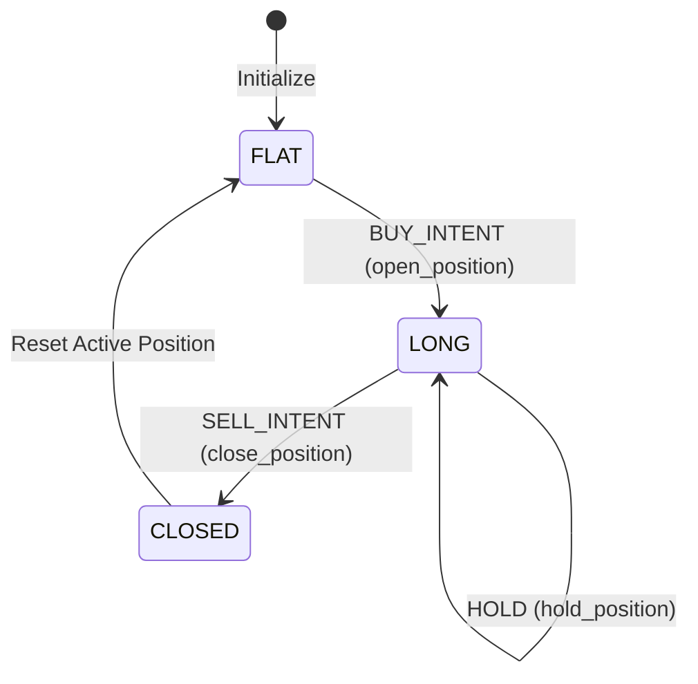

# Position Lifecycle Engine Verification Report

This report documents the design, implementation, and successful verification of the **Valkyrie V2 Position Lifecycle Engine**. The engine provides a robust, stateful tracking layer that transitions chronological trade intents into audited option positions.

---

## 1. Engine Architecture & State Machine

The position lifecycle operates as a strict state machine. A single active position is managed at any given time, conforming to the following state transitions:



### State Transitions & Logic
* **FLAT**: No active position exists.
* **LONG**: A position is open. All parameters (strike, expiry, option type, instrument key, lot size, quantity) are frozen. Subsequent BUY signals are rejected.
* **CLOSED**: The active position has been squared off, and its exit time, premium, and final status are recorded. The manager resets to FLAT.

---

## 2. Safety Guards & Protections

To protect the backtester against execution anomalies, the following guards are strictly enforced:

| Guard | Trigger | Action | Verification |
| :--- | :--- | :--- | :--- |
| **Pyramiding Guard** | `BUY_INTENT` event while state is `LONG` | Raises `ValueError` | `test_reject_buy_while_long` |
| **Illegal Exit Guard** | `SELL_INTENT` event while state is `FLAT` | Raises `ValueError` | `test_reject_sell_while_flat` |
| **Contract Immutability** | `HOLD` or `SELL_INTENT` events | Retains entry `strike`, `expiry`, and `instrument_key` | `test_contract_immutability_on_hold`, `test_contract_immutability_on_close` |
| **Lot Size Multiplier** | `BUY_INTENT` initialization | Resolves lot sizes (`75` for NIFTY, `15` for BANKNIFTY) and calculates total trade quantity | `test_quantity_calculation_lot_sizes` |

---

## 3. Pydantic Model Schema & Ledger Design

The tracking layer uses structured models in `backend/v2/position_models.py` to ensure complete schema enforcement and validation:

### Core Pydantic Models

1. **`Position`**: Tracks active/historical position details.
   * `position_id`: UUID string.
   * `status`: `FLAT \| LONG \| CLOSED`.
   * `underlying`: e.g., `"NIFTY"`.
   * `strike`, `expiry`, `option_type`, `instrument_key`.
   * `entry_time` & `entry_premium`.
   * `exit_time` & `exit_premium` (optional).
   * `lot_size` & `quantity`.

2. **Lifecycle Events**:
   * **`PositionOpened`**: Logs details at entry.
   * **`PositionHeld`**: Logs intermediate premium updates on every held candle.
   * **`PositionClosed`**: Logs final execution details at square-off.

### Ledger Design (`PositionLedger`)
The ledger maintains:
* `positions`: List of all `Position` objects.
* `events`: List of all lifecycle events.
* `to_dict()`: Exports the full state for reporting and API consumption.

---

## 4. Test Execution Results

We verified the Position Lifecycle Engine with **27 comprehensive tests** in `backend/v2/test_position_manager.py`.

### Run Evidence:
```bash
PYTHONPATH=backend ./venv/bin/python -m unittest backend/v2/test_position_manager.py
```
```text
Ran 27 tests in 0.893s

OK
```

All 27 tests passed successfully, covering:
* Unit transitions (`FLAT -> LONG`, `LONG -> LONG`, `LONG -> CLOSED`).
* Rejection rules for duplicate buys and flat sells.
* Contract immutability verification.
* Replay engine integration (correctly executing 11 completed lifecycles on `2025-04-15`).
* Multi-day replay persistence.
* Expiry boundary rollover and date alignment.

---

## 5. Execution Logs (Replay Walk-Through on 2025-04-15)

During the replay run on `2025-04-15` (NIFTY, 5m EMA strategy), the engine logged the following lifecycle transitions:

* **Trade 1 Entry**:
  * `2025-04-15T09:35:00` | `BUY_INTENT` | `23300.0 CE (2025-04-17)` | Premium: `133.60`
  * *State Transition*: `FLAT` $\rightarrow$ `LONG`
* **Trade 1 Exit**:
  * `2025-04-15T09:55:00` | `SELL_INTENT` | `23300.0 CE (2025-04-17)` | Premium: `134.60`
  * *State Transition*: `LONG` $\rightarrow$ `CLOSED` (Flat)
* **Trade 2 Entry**:
  * `2025-04-15T10:10:00` | `BUY_INTENT` | `23300.0 CE (2025-04-17)` | Premium: `127.65`
* **Trade 2 Exit**:
  * `2025-04-15T10:15:00` | `SELL_INTENT` | `23300.0 CE (2025-04-17)` | Premium: `127.25`
* **Trade 3 Entry**:
  * `2025-04-15T10:20:00` | `BUY_INTENT` | `23300.0 CE (2025-04-17)` | Premium: `118.25`
* **Trade 3 Exit**:
  * `2025-04-15T10:30:00` | `SELL_INTENT` | `23300.0 CE (2025-04-17)` | Premium: `123.05`
* **Trade 4 Entry**:
  * `2025-04-15T10:40:00` | `BUY_INTENT` | `23300.0 CE (2025-04-17)` | Premium: `119.00`
* **Trade 4 Exit**:
  * `2025-04-15T10:50:00` | `SELL_INTENT` | `23300.0 CE (2025-04-17)` | Premium: `120.75`
* **Trade 5 Entry**:
  * `2025-04-15T10:55:00` | `BUY_INTENT` | `23300.0 CE (2025-04-17)` | Premium: `118.70`
* **Trade 5 Exit**:
  * `2025-04-15T11:05:00` | `SELL_INTENT` | `23300.0 CE (2025-04-17)` | Premium: `117.75`
* **Trade 6 Entry**:
  * `2025-04-15T11:20:00` | `BUY_INTENT` | `23300.0 CE (2025-04-17)` | Premium: `116.00`
* **Trade 6 Exit**:
  * `2025-04-15T11:40:00` | `SELL_INTENT` | `23300.0 CE (2025-04-17)` | Premium: `116.80`
* **Trade 7 Entry**:
  * `2025-04-15T11:50:00` | `BUY_INTENT` | `23300.0 CE (2025-04-17)` | Premium: `112.90`
* **Trade 7 Exit**:
  * `2025-04-15T12:50:00` | `SELL_INTENT` | `23300.0 CE (2025-04-17)` | Premium: `133.40`
* **Trade 8 Entry**:
  * `2025-04-15T13:00:00` | `BUY_INTENT` | `23350.0 CE (2025-04-17)` | Premium: `103.20`
* **Trade 8 Exit**:
  * `2025-04-15T13:10:00` | `SELL_INTENT` | `23350.0 CE (2025-04-17)` | Premium: `102.35`
* **Trade 9 Entry**:
  * `2025-04-15T14:10:00` | `BUY_INTENT` | `23350.0 CE (2025-04-17)` | Premium: `76.95`
* **Trade 9 Exit**:
  * `2025-04-15T14:25:00` | `SELL_INTENT` | `23350.0 CE (2025-04-17)` | Premium: `82.15`
* **Trade 10 Entry**:
  * `2025-04-15T14:45:00` | `BUY_INTENT` | `23300.0 CE (2025-04-17)` | Premium: `85.95`
* **Trade 10 Exit**:
  * `2025-04-15T14:55:00` | `SELL_INTENT` | `23300.0 CE (2025-04-17)` | Premium: `91.00`
* **Trade 11 Entry**:
  * `2025-04-15T15:05:00` | `BUY_INTENT` | `23300.0 CE (2025-04-17)` | Premium: `84.10`
* **Trade 11 Exit**:
  * `2025-04-15T15:25:00` | `SELL_INTENT` | `23300.0 CE (2025-04-17)` | Premium: `110.40`
