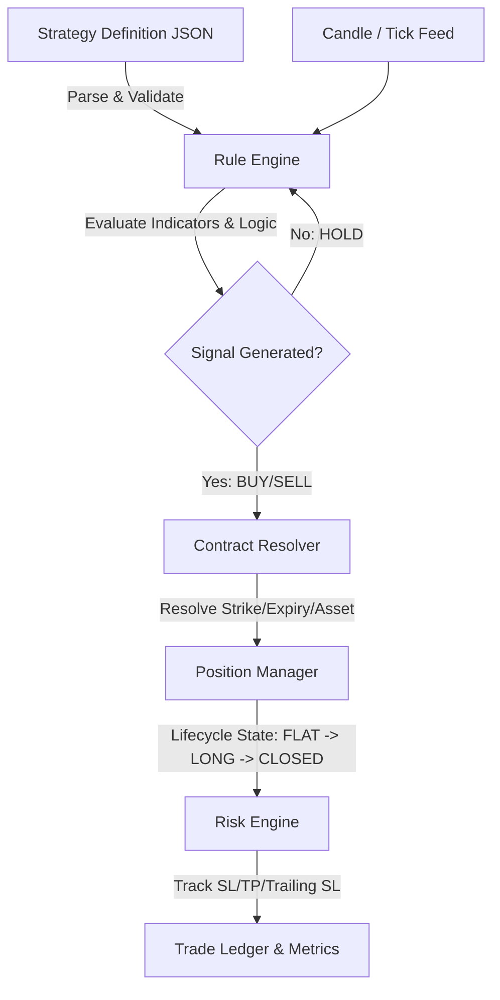

# Strategy Builder Architecture Design (Phase 13C.8A)

This document specifies the unified, data-driven strategy architecture for the Valkyrie system. This architecture establishes a standardized JSON-based strategy definition schema that decouples trading logic from the core execution engines. 

This design enables backtesting, optimization, walk-forward analysis, Monte Carlo simulation, paper trading, and institutional live execution to use a single, shared logic engine without writing strategy-specific code.

---

## 1. Core Architecture Overview

In this framework, a strategy is defined entirely as data (JSON). The system parses this JSON into a runtime execution tree.



### Advantages of the Unified Architecture
1. **Zero-Code Strategy Deployment**: Users define strategies visually in the UI, saving them as JSON schemas. No backend Python code modifications are needed.
2. **Deterministic Parity**: The same rule-evaluation engine runs historical candles (backtesting) and real-time WebSockets (paper & live trading), eliminating execution discrepancy.
3. **Seamless Parameter Sweeps**: The optimization engine simply overrides numeric variables in the JSON tree, running configurations dynamically.

---

## 2. StrategyDefinition Schema

The `StrategyDefinition` is the root configuration object. It must be versioned to allow backward-compatible upgrades as the platform evolves.

### Required Fields
- `strategy_id` (string): Unique UUID.
- `name` (string): Human-readable name.
- `description` (string): Detailed strategy description.
- `schema_version` (string): SemVer version (e.g., `"2.0.0"`).
- `signal` (object): Indicator parameters and entry logic tree.
- `contract_selection` (object): Underlying asset, instrument type, and option/future resolution criteria.
- `risk` (object): Risk boundaries, position sizing, and safeguard limits.
- `exit` (object): Rules for closing active positions.

### Optional Fields
- `author` (string): Name of creator.
- `metadata` (object): User-defined dictionary for UI tags, categories, or performance notes.
- `parameters` (array): Configurable variable definitions for optimization sweep discovery.

### Versioning & Migration Strategy
- **JSON Schema Validation**: Every strategy JSON uploaded must be verified against a master meta-schema (`strategy_schema_v2.json`) using standard draft-07 validators.
- **Migration Pipeline**: If a schema update is released (e.g., adding multi-leg strategies in version `3.0.0`), a migration handler will map legacy structures.
  ```python
  def migrate_v2_to_v3(strategy_json: dict) -> dict:
      # Automatically convert single contract_selection to multi-leg list
      if "contract_selection" in strategy_json:
          strategy_json["legs"] = [strategy_json.pop("contract_selection")]
          strategy_json["schema_version"] = "3.0.0"
      return strategy_json
  ```

---

## 3. The Four Mandatory Sections

To enforce modularity, every strategy definition must partition its rules into four independent sections:

```
┌────────────────────────────────────────────────────────┐
│                   Strategy JSON                        │
├────────────────────────────────────────────────────────┤
│ 1. Signal (Entry Logic)                                │
│    - Indicator definitions & Boolean Logic Tree        │
├────────────────────────────────────────────────────────┤
│ 2. Contract Selection (Asset Resolution)               │
│    - Strike, Expiry, Delta, Premium, DTE               │
├────────────────────────────────────────────────────────┤
│ 3. Risk (Trade Protections)                            │
│    - SL/TP, Trailing SL, Position Sizing, Daily Limits │
├────────────────────────────────────────────────────────┤
│ 4. Exit (Exit Signals)                                 │
│    - Reversal flags, Expiry, Hard cutoffs              │
└────────────────────────────────────────────────────────┘
```

1. **Signal (Entry)**: Defines *when* to execute a trade. It parses price charts to emit entry intents. Separating this logic ensures indicator calculations do not leak into execution details.
2. **Contract Selection**: Defines *what* asset to trade. When a signal is triggered, it resolves the underlying asset into specific trading contracts (e.g., ATM Call options). This isolates market-structure details from technical analysis.
3. **Risk**: Defines *how much* to trade and trade-level guardrails. It controls lot sizes, fixed stop-losses, and profit targets. This acts as a pre-trade and intra-trade safety net.
4. **Exit**: Defines *how* to exit a trade outside of basic stop-losses. It includes rules like signal reversals (exiting LONG when a PE signal occurs) or session end cutoffs. This prevents entry/exit logical feedback loops.

---

## 4. Signal Engine & Logical Operators

The Signal Engine evaluates indicator math and logical expressions. It constructs an **Abstract Syntax Tree (AST)** of conditions.

### Supported Indicators (Schema definitions only)
- **EMA / SMA**: Period, Price Source (Close, Open, High, Low).
- **Heikin Ashi**: Smoothing Period, Candle Color.
- **RSI**: Period, Source, Overbought/Oversold levels.
- **MACD**: Fast Period, Slow Period, Signal Period.
- **Volume**: Moving Average Period, Multiplier.
- **Price Action**: Crossover, Crossover Up, Crossover Down, Greater Than, Less Than, Touches.
- **Custom Indicators**: Mathematical formulas represented as string expressions (e.g., `(close - low) / (high - low) * 100`).

### Logical Operators
The engine evaluates nested boolean conditions using logical operators:
- **`AND`**: Returns `true` if all sub-conditions are met.
- **`OR`**: Returns `true` if at least one sub-condition is met.
- **`NOT`**: Inverts the boolean result of a child condition.

#### Nested Groups Expression Example
Mathematical representation:
$$\text{Signal} = (\text{EMA Crossover Up} \land \text{Heikin Ashi is Green}) \lor (\text{RSI} > 60)$$

JSON Logic representation:
```json
{
  "operator": "OR",
  "conditions": [
    {
      "operator": "AND",
      "conditions": [
        {
          "type": "crossover_up",
          "params": { "primary": "EMA_9", "secondary": "EMA_21" }
        },
        {
          "type": "equal",
          "params": { "primary": "HA_Color", "value": "GREEN" }
        }
      ]
    },
    {
      "type": "greater_than",
      "params": { "primary": "RSI_14", "value": 60 }
    }
  ]
}
```

---

## 5. Contract Selection Design

The Contract Selection module maps underlying asset signals to liquid options or futures contracts.

### Supported Selection Criteria
- **Underlying**: Key identifier (e.g., `"NSE_INDEX|Nifty 50"` or `"NSE_EQ|RELIANCE"`).
- **Option Type**: `"CE_ONLY"`, `"PE_ONLY"`, `"CE_PE"`.
- **Strike Selection**:
  - `mode`: `"ATM"`, `"ATM_PLUS_N"`, `"ATM_MINUS_N"`, `"DELTA"`, `"PREMIUM_RANGE"`.
  - `delta_target`: Target delta value (e.g., `0.30` or `0.50`).
  - `premium_min` / `premium_max`: Desired premium band (e.g., target premium close to ₹100).
- **Expiry Selection**:
  - `mode`: `"CURRENT_WEEKLY"`, `"NEXT_WEEKLY"`, `"CURRENT_MONTHLY"`, `"DTE_RANGE"`.
  - `roll_threshold_hours`: Hours before expiry to roll contracts forward (e.g., `2.0` hours).
  - `dte_min` / `dte_max`: Desired Days To Expiry range (e.g., select option with DTE between 2 and 7 days).

---

## 6. Risk Engine Design

The Risk Engine enforces safety parameters on every trade attempt.

- **Position Sizing Rules**:
  - `sizing_mode`: `"FIXED_LOTS"`, `"PERCENT_OF_BALANCE"`, `"RISK_PER_TRADE"`.
  - `value`: Lot quantity or equity percentage value.
- **Fixed SL**: Stop-loss triggered by a flat value, percentage, or price points (e.g., 20 points from entry premium).
- **Fixed Target**: Profit target triggered by points or percentages.
- **Trailing SL**:
  - `type`: `"none"`, `"points"`, `"percent"`.
  - `callback_threshold`: Minimum premium movement before trailing begins.
  - `trail_gap`: Distance maintained behind the peak premium.
- **Time Exit**: Maximum candles to hold or hard cutoff times (e.g., `15:25`).
- **Daily Loss Limit**: Overall account protection. If net daily PnL drops below `-X%`, the engine freezes strategy trading.

---

## 7. Exit Engine Design

The Exit Engine defines rules to trigger position closures outside of the Risk Engine's hard stops.

- **Reverse Signal**: If a PE entry signal occurs while holding a CE position, the CE position is closed immediately, and a PE position is opened.
- **Target / SL Hit**: Triggers when the Risk Engine reports a target or stop-loss breach.
- **Time Exit**: Hard cutoff execution (e.g., close all positions at 15:15 to avoid overnight risk).
- **Expiry Exit**: Liquidates option positions if holding them too close to final settlement.
- **Manual Exit**: Support for REST API manual overrides to liquidate positions instantly.

---

## 8. JSON Strategy Schema Examples

### Example 1: EMA Crossover Strategy
This strategy buys a weekly NIFTY ATM CE option when the 9 EMA crosses above the 21 EMA. It has a 30-point stop loss and exits before the market closes.

```json
{
  "strategy_id": "8a7e4bdf-29e1-4c12-881b-ccdf7481fae2",
  "name": "EMA Crossover CE Buy",
  "description": "9 EMA crosses 21 EMA. Trades ATM Call options.",
  "schema_version": "2.0.0",
  "signal": {
    "indicators": {
      "ema_fast": { "type": "EMA", "params": { "period": 9, "source": "close" } },
      "ema_slow": { "type": "EMA", "params": { "period": 21, "source": "close" } }
    },
    "entry_condition": {
      "type": "crossover_up",
      "params": {
        "primary": "ema_fast",
        "secondary": "ema_slow"
      }
    }
  },
  "contract_selection": {
    "underlying": "NSE_INDEX|Nifty 50",
    "instrument_type": "OPTION",
    "option_type": "CE_ONLY",
    "strike": { "mode": "ATM" },
    "expiry": { "mode": "CURRENT_WEEKLY", "roll_threshold_hours": 2.0 }
  },
  "risk": {
    "position_sizing": { "sizing_mode": "FIXED_LOTS", "value": 1 },
    "stop_loss": { "type": "points", "value": 30.0 },
    "take_profit": { "type": "none", "value": 0.0 },
    "trailing_sl": { "type": "none" }
  },
  "exit": {
    "exit_on_reversal": true,
    "time_exit": { "cutoff_time": "15:25" }
  }
}
```

### Example 2: Green After Red
This strategy buys when a red Heikin Ashi candle is followed by a green Heikin Ashi candle on 5-minute charts.

```json
{
  "strategy_id": "3b2e5c8a-93ef-4f11-ba8e-cddf928e12ff",
  "name": "HA Green After Red",
  "description": "Enters CE on Heikin Ashi candle color reversal from Red to Green.",
  "schema_version": "2.0.0",
  "signal": {
    "indicators": {
      "ha_engine": { "type": "HEIKIN_ASHI", "params": { "smoothing": 1 } }
    },
    "entry_condition": {
      "operator": "AND",
      "conditions": [
        {
          "type": "equal",
          "params": { "primary": "ha_engine.color[-2]", "value": "RED" }
        },
        {
          "type": "equal",
          "params": { "primary": "ha_engine.color[-1]", "value": "GREEN" }
        }
      ]
    }
  },
  "contract_selection": {
    "underlying": "NSE_INDEX|Nifty 50",
    "instrument_type": "OPTION",
    "option_type": "CE_ONLY",
    "strike": { "mode": "ATM" },
    "expiry": { "mode": "CURRENT_WEEKLY", "roll_threshold_hours": 2.0 }
  },
  "risk": {
    "position_sizing": { "sizing_mode": "FIXED_LOTS", "value": 1 },
    "stop_loss": { "type": "points", "value": 15.0 },
    "take_profit": { "type": "points", "value": 45.0 },
    "trailing_sl": { "type": "none" }
  },
  "exit": {
    "exit_on_reversal": false,
    "time_exit": { "cutoff_time": "15:15" }
  }
}
```

### Example 3: EMA + HA
Enters when the price is above the 50 EMA and the Heikin Ashi candle is Green.

```json
{
  "strategy_id": "4b7e8dcf-39e4-4d8e-b81b-aa47df90e3cb",
  "name": "EMA Trend filter + HA Trigger",
  "description": "Price above 50 EMA filtered with HA Green candle for confirmation.",
  "schema_version": "2.0.0",
  "signal": {
    "indicators": {
      "ema_50": { "type": "EMA", "params": { "period": 50, "source": "close" } },
      "ha_engine": { "type": "HEIKIN_ASHI", "params": { "smoothing": 1 } }
    },
    "entry_condition": {
      "operator": "AND",
      "conditions": [
        {
          "type": "greater_than",
          "params": { "primary": "close", "value": "ema_50" }
        },
        {
          "type": "equal",
          "params": { "primary": "ha_engine.color[-1]", "value": "GREEN" }
        }
      ]
    }
  },
  "contract_selection": {
    "underlying": "NSE_INDEX|Nifty 50",
    "instrument_type": "OPTION",
    "option_type": "CE_ONLY",
    "strike": { "mode": "ATM" },
    "expiry": { "mode": "CURRENT_WEEKLY", "roll_threshold_hours": 2.0 }
  },
  "risk": {
    "position_sizing": { "sizing_mode": "FIXED_LOTS", "value": 1 },
    "stop_loss": { "type": "percent", "value": 10.0 },
    "take_profit": { "type": "percent", "value": 30.0 },
    "trailing_sl": { "type": "none" }
  },
  "exit": {
    "exit_on_reversal": true,
    "time_exit": { "cutoff_time": "15:25" }
  }
}
```

### Example 4: Institutional Multi-Condition Strategy
An options scalping strategy that uses trend, volume, and momentum indicators. It trades weekly ATM options with trailing stop-losses.

```json
{
  "strategy_id": "9c8e7dcf-18b7-4a6c-928b-bba3e8d7c1ff",
  "name": "Alpha Option Scalper V2",
  "description": "Combines EMA crossover, RSI momentum, and volume spikes. Evaluates NIFTY options.",
  "schema_version": "2.0.0",
  "signal": {
    "indicators": {
      "ema_9": { "type": "EMA", "params": { "period": 9, "source": "close" } },
      "ema_21": { "type": "EMA", "params": { "period": 21, "source": "close" } },
      "rsi_14": { "type": "RSI", "params": { "period": 14, "source": "close" } },
      "vol_ma": { "type": "VolumeMA", "params": { "period": 20 } }
    },
    "entry_condition": {
      "operator": "AND",
      "conditions": [
        {
          "type": "greater_than",
          "params": { "primary": "ema_9", "secondary": "ema_21" }
        },
        {
          "type": "greater_than",
          "params": { "primary": "rsi_14", "value": 55.0 }
        },
        {
          "type": "less_than",
          "params": { "primary": "rsi_14", "value": 75.0 }
        },
        {
          "type": "greater_than",
          "params": { "primary": "volume", "secondary": "vol_ma", "multiplier": 1.5 }
        }
      ]
    }
  },
  "contract_selection": {
    "underlying": "NSE_INDEX|Nifty 50",
    "instrument_type": "OPTION",
    "option_type": "CE_PE",
    "strike": { "mode": "DELTA", "delta_target": 0.50 },
    "expiry": { "mode": "CURRENT_WEEKLY", "roll_threshold_hours": 2.0 }
  },
  "risk": {
    "position_sizing": { "sizing_mode": "FIXED_LOTS", "value": 2 },
    "stop_loss": { "type": "points", "value": 20.0 },
    "take_profit": { "type": "points", "value": 60.0 },
    "trailing_sl": {
      "type": "points",
      "callback_threshold": 15.0,
      "trail_gap": 10.0
    }
  },
  "exit": {
    "exit_on_reversal": true,
    "time_exit": { "cutoff_time": "15:20" }
  }
}
```

---

## 9. Compatibility Matrix

| Engine | Compatibility Status | Required Integration Points |
| :--- | :---: | :--- |
| **Historical Replay** | **COMPATIBLE** | Replaces static signal generation loops with a dynamic Signal Evaluator instance that parses the strategy JSON. |
| **Optimization Engine** | **COMPATIBLE** | Replaces simple key/value configs with a JSON tree modifier that updates variables (e.g., fast EMA period) within the rule nodes. |
| **Walk Forward Analysis** | **COMPATIBLE** | Runs the optimization engine over rolling time windows, writing the optimized parameters back to the JSON file. |
| **Monte Carlo Analysis** | **COMPATIBLE** | Independent of strategy logic. It resamples the trade output ledger generated by the strategy run. |
| **Paper Trading** | **COMPATIBLE** | Replaces database query loaders with real-time websocket candle buffers inside the Signal Evaluator. |
| **Live Trading** | **COMPATIBLE** | Communicates with the live broker API (e.g., Upstox API) instead of the paper trading database. |

---

## 10. Future-Proofing & Extensibility Audit

- **Asset Support (NIFTY, BANKNIFTY, SENSEX, Stocks, Futures, Options)**: The decoupled Contract Resolver abstracts all specific contract formats. Resolving a `"CE"` option or `"FUT"` future uses the same underlying triggers.
- **Multi-Leg Strategies**: The schema is designed to scale to multi-leg structures by changing `contract_selection` into an array of legs (e.g., a Bull Call Spread leg list).
  ```json
  "legs": [
    { "type": "CE_BUY", "strike": { "mode": "ATM" } },
    { "type": "CE_SELL", "strike": { "mode": "ATM_PLUS_1" } }
  ]
  ```

---

## 11. Recommendations

1. **Implement JSON Schema Validation**: Use `pydantic` in the FastAPI backend to build robust schemas for indicators, rules, and risk configurations.
2. **Build an AST Logical Evaluator**: Write a parser that traverses the conditions tree recursively. This handles logic parsing cleanly and is easy to debug.
3. **Use a Shared Signal Evaluator**: Ensure both backtest replays and live streams share the exact same evaluation logic code. This ensures consistency and prevents parity drift.
