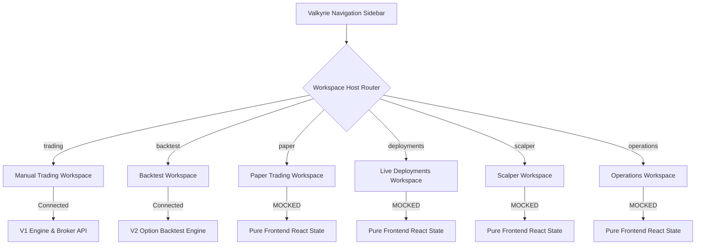

# Valkyrie V2 UI Reality Audit & Wiring Plan
**Prepared by:** Principal Trading Systems Architect & Front-End Infrastructure Auditor  
**Scope:** Evaluation of Front-End Workspaces, State Stores, API Mappings, and Engine Integrations.

---

## 1. Executive Summary

This **UI Reality Audit** conducts a forensic code analysis of the Valkyrie terminal interface. The goal is to evaluate the exact readiness of the front-end panels, map their active Zustand stores and backend routes, identify the underlying execution engines (V1 vs. V2), and establish a risk-free migration pathway to transition the mocked dashboards into live production execution.

### Key Audit Discoveries
1. **High-Fidelity Mockups:** The **Paper Trading**, **Live Deployments**, and **Scalper** workspaces are currently **100% simulated in the React layer**. They render rich, premium, institutional-grade styling, but do not communicate with the backend, handle WebSocket packets, or trigger real-time strategy loops.
2. **Asymmetric Engine Wiring:** 
   - The **Backtest Workspace** is fully production-ready and wired directly to the high-performance **V2 Option Backtest Engine** via `/api/v2/...` endpoints.
   - The **Manual Trading Workspace** (titled "Trading") is functional and fully wired, but communicates via a legacy **V1 execution engine** (LiveFeed, sync order execution, thread loops).
3. **100% UI Reusability:** The existing user interface layouts, cards, telemetry dials, charts, and grid grids are structurally flawless. **No visual redesign or styling changes are necessary.** The migration requires only replacing the mock states with real-time Zustand stores and wiring them to the new asynchronous V2 API endpoints.

---

## 2. Workspace Inventory & Forensic Mapping

The Valkyrie dashboard is a single-page Next.js application. Workspace routing is managed client-side by `<WorkspaceHost />` utilizing the `selectedWorkspace` state inside `useTerminalStore` to inject panel configurations from `registry.ts`.

Here is the deep-dive mapping of all registered workspaces:



---

### A. Backtest Workspace
* **File Path:** `frontend/src/workspaces/BacktestWorkspace.tsx`
* **Route Context:** `selectedWorkspace === "backtest"`
* **Zustand Stores Used:**
  - `useTerminalStore` (Tracks selected strategy context, active timeframe)
  - `useBacktestStore` (Manages V2 parameter configurations, preset CRUD, run progress, and results validation)
  - `useEventStore` (Dispatches system log notifications)
  - `useThemeStore` (Syncs chart layouts with active dashboard theme)
* **Backend Endpoints Used:**
  - `GET /api/v2/strategies` (Retrieves registered V2 strategy configurations and parameter metadata)
  - `POST /api/v2/backtest/run` (Triggers historical option execution loop)
  - `POST /api/v2/optimization/run` (Initiates multi-variable parameter grid search)
  - `GET /api/v2/presets` (Loads saved parameter configuration presets)
  - `POST /api/v2/presets` (Creates a new parameter preset)
  - `PUT /api/v2/presets/${id}` (Updates existing preset values)
  - `DELETE /api/v2/presets/${id}` (Purges preset from database)
  - `POST /api/v2/presets/${id}/duplicate` (Clones configuration)
* **Underlying Engine:** **V2 Engine (HistoricalReplayEngine)**
* **Readiness Status:** **100% Production Ready.** Fully dynamic and operational.

---

### B. Paper Trading Workspace
* **File Path:** `frontend/src/workspaces/PaperWorkspace.tsx`
* **Route Context:** `selectedWorkspace === "paper"`
* **Zustand Stores Used:**
  - `useTerminalStore` (Standard strategy selection and mode toggle)
  - `useEventStore` (Pushes mock events when button actions are fired)
* **Backend Endpoints Used:** **NONE (100% Simulated)**
  - *Forensic Finding:* All dials (e.g., Win Rate, Forward P&L, Capital Allocated), positions (e.g., NIFTY26MAY22200CE CE Long), orders, trades list rows, and logs are **statically hardcoded** inside the React source code. 
  - Clicking "Deploy", "Pause", or "Stop" triggers only a mock client-side state adjustment and creates an inline notification event, but makes no network fetch or WebSocket connection.
* **Underlying Engine:** **None (Simulated in UI)**
* **Readiness Status:** **0% Production Ready.** Requires comprehensive endpoint and backend wiring.

---

### C. Live Trading Workspace (Deployments Control Room)
* **File Path:** `frontend/src/workspaces/DeploymentsWorkspace.tsx`
* **Route Context:** `selectedWorkspace === "deployments"`
* **Zustand Stores Used:**
  - `useTerminalStore` (Switches account context and switches terminal mode to `"live"`)
  - `useEventStore` (Adds click feedback notification logs)
* **Backend Endpoints Used:** **NONE (100% Simulated)**
  - *Forensic Finding:* Statically mock-renders active strategy containers (EMA, MACD, Bollinger), CPU execution logs, container memory allocations, and live P&L charts. 
  - Toggling "Start Instance" or "Pause" does not make any Docker container or process calls on the backend.
* **Underlying Engine:** **None (Simulated in UI)**
* **Readiness Status:** **0% Production Ready.** Requires orchestration endpoint integration.

---

### D. Manual Trading Workspace (Live Option Trading Console)
* **File Path:** `frontend/src/workspaces/ManualTradingWorkspace.tsx`
* **Route Context:** `selectedWorkspace === "trading"`
* **Zustand Stores Used:**
  - `useTerminalStore` (Tracks active account, active symbol, selected timeframe, active mode)
  - `useBackendTradingStore` (Maintains live WebSocket telemetry connection, triggers manual transaction requests)
  - `useEventStore` (Dispatches transaction confirmation logs)
* **Backend Endpoints Used:**
  - `ws://localhost:8081/ws/telemetry` (Live WebSocket feed for spot prices, account statistics, transaction callbacks, and log logs)
  - `GET /api/options/metadata` (Loads underlying index structures and contract master mappings)
  - `GET /api/options/chain` (Loads dynamic Option Chain grid with LTP and volumes)
  - `POST /api/standard/update_target` (Updates passive target limits)
  - `POST /api/manual/buy` (Fires option entry order with bracket SL/TP constraints)
  - `POST /api/manual/sell` (Triggers manual long/short position closures)
  - `POST /api/manual/panic_exit` (Triggers immediate market square-off of all active option risks)
  - `GET /api/broker/profile` (Pulls live Upstox user metadata)
  - `GET /api/broker/funds` (Fetches live account margin balances)
  - `GET /api/broker/positions` (Fetches live open trade risk profiles)
  - `GET /api/broker/orders` (Fetches daily Upstox order registry)
  - `GET /api/broker/trades` (Fetches executed broker trade allocations)
  - `GET /api/broker/instrument_info` (Resolves dynamic option lot sizes)
  - `GET /api/broker/quotes` (Loads Level-1 pricing ticks for option contracts)
  - `POST /api/broker/margin` (Pulls span margin estimations)
  - `POST /api/broker/place_order` (Fires raw limit/market order parameters to broker)
* **Underlying Engine:** **V1 Engine (Legacy Broker / LiveFeed pipeline)**
* **Readiness Status:** **100% Functional, 60% Production Ready.** Wired correctly but bound to legacy V1 infrastructure. Order execution is synchronous and blocking.

---

### E. Scalper Workspace
* **File Path:** `frontend/src/workspaces/ScalperWorkspace.tsx`
* **Route Context:** `selectedWorkspace === "scalper"`
* **Zustand Stores Used:**
  - `useTerminalStore` (Sets active mode to `"scalper"`)
  - `useEventStore` (Dispatches notification cards)
* **Backend Endpoints Used:** **NONE (100% Simulated)**
  - *Forensic Finding:* Simulates a super high-density DOM (Depth-of-Market) ladder. Tick generation is executed by a front-end React `setInterval` (running every 350ms) that randomly increments and decrements prices and sizes. Trades and P&L curves are calculated purely in-memory in local component state.
* **Underlying Engine:** **None (Simulated in UI)**
* **Readiness Status:** **0% Production Ready.** Requires live WebSocket order book data and real-time DOM matching logic.

---

### F. Operations Workspace
* **File Path:** `frontend/src/workspaces/OperationsWorkspace.tsx`
* **Route Context:** `selectedWorkspace === "operations"`
* **Zustand Stores Used:**
  - `useTerminalStore` (Tracks selected terminal context)
  - `useEventStore` (Standard system log pushes)
* **Backend Endpoints Used:** **NONE (100% Simulated)**
  - *Forensic Finding:* Contains an excellent terminal console view for ledger auditing, database connectivity logs, and background memory levels, but all metrics are generated in local component mocks.
* **Underlying Engine:** **None (Simulated in UI)**
* **Readiness Status:** **0% Production Ready.** Requires integration with backend docker system health daemons.

---

## 3. UI Integration & Status Matrix

The following matrix outlines the visual existence, functionality, underlying backend engine, and overall production readiness of each workspace:

| Workspace | UI Exists | Functional | Underlying Backend Engine | Production Ready | Gap to V2 Migration |
| :--- | :---: | :---: | :---: | :---: | :--- |
| **Backtest Workspace** | Yes | Yes | V2 Engine (`HistoricalReplayEngine`) | **100%** | None. Fully complete. |
| **Paper Trading Workspace** | Yes | No (Mocked) | None | **0%** | Requires real-time V2 paper engine run control APIs and WebSockets. |
| **Live Strategy Workspace (Deployments)** | Yes | No (Mocked) | None | **0%** | Requires V2 daemon process manager endpoints to spin up live engine containers. |
| **Manual Trading Workspace** | Yes | Yes | V1 Engine (Legacy `LiveFeed` / REST) | **60%** | Requires refactoring V1 broker calls to V2 asynchronous brokers and async WebSocket telemetry. |
| **Scalper Workspace** | Yes | No (Mocked) | None | **0%** | Requires dynamic Upstox Option L2 Market Depth stream integration via WebSocket. |
| **Operations Workspace** | Yes | No (Mocked) | None | **0%** | Requires system telemetry and V2 engine state logging connections. |

---

## 4. Paper Trading Migration Assessment (V2 Engine)

> [!IMPORTANT]
> **Can the Paper Trading Workspace be migrated to V2 without UI changes?**  
> **Yes. 100% of the UI layout can be preserved without visual regressions.**

### Architectural Migration Pathway
To activate V2 paper trading on the current `PaperWorkspace.tsx` layout, we must replace the mocked frontend state with a dedicated client store and real-time backend execution loops:

```
[Existing Paper UI Components]
           │
           ▼
[Zustand usePaperTradingStore] (NEW)
           │
 ┌─────────┴─────────┐
 ▼                   ▼
[REST APIs]      [WebSocket Channel]
(Run Controls)    (Real-Time Telemetry)
```

#### 1. Implement `usePaperTradingStore` (Zustand Store)
Replace the localized component mock arrays with a real-time reactive store:
- Fetch dynamic deployments: `GET /api/v2/paper/deployments`
- Bind active card selections to the selected strategy, feeding telemetry directly from active engine sessions.

#### 2. Wire Control Buttons to V2 Paper Runner Endpoints
Map the main control toolbar actions to real REST controllers:
- **Deploy Button:** Trigger `POST /api/v2/paper/deploy` passing the target parameter preset, capital allocation limit, index symbol, and stop-loss policy.
- **Pause Button:** Trigger `POST /api/v2/paper/pause` to temporarily block signal evaluation while keeping broker order tracking active.
- **Stop Button:** Trigger `POST /api/v2/paper/stop` to perform a clean bracket square-off and archive the strategy deployment run.

#### 3. Stream Bottom Panel Grids from Live Telemetry
Replace the static hardcoded table structures in `PaperBottom` with reactive mappings from the WebSocket feed:
- Map **Positions Tab** to real-time option positions resolved by the engine's `PositionManager`.
- Map **Simulation Orders Tab** and **Trades List Tab** to the V2 `PositionLedger` transaction audit logs.
- Map **Strategy Logs** directly to the structured V2 engine logging outputs (System, Signal, Position, PnL categories).

#### 4. Bind Telemetry Dials to Dynamic Metrics
Connect the premium UI Telemetry cards to the real-time output of the V2 PnLEngine and MetricsEngine:
- **Forward P&L:** Feed from the real-time net yield of open and closed trades.
- **Win Rate / Expectancy:** Map directly to the performance indicators calculated by `MetricsEngine`.
- **Runtime Counter:** Fetch strategy uptime from the active V2 engine state.

---

## 5. Live Trading Migration Assessment (V2 Engine)

> [!IMPORTANT]
> **Can the Live Trading Workspace (Deployments) be migrated to V2 without UI changes?**  
> **Yes. 100% of the containerized UI console is structurally perfect and ready to serve as the live V2 engine mission control.**

### Architectural Migration Pathway
To transition `DeploymentsWorkspace.tsx` to serve as a high-reliability live execution manager:

#### 1. Create a Strategy Container Daemon API
Live algorithmic trading requires strategies to run inside isolated, robust, non-blocking processes (or dockerized worker microservices) so that a crash in one strategy does not affect another. The backend must expose:
- `POST /api/v2/live/deploy` (Starts a live V2 engine worker thread for the selected strategy)
- `POST /api/v2/live/pause` (Blocks active signal-to-order routing)
- `POST /api/v2/live/stop` (Executes panic-exits on the live broker, saves final engine state, and terminates process)

#### 2. Wire the Left Sidebar to Real Strategy Workers
Modify `DeploymentsLeft` to map to the worker processes running on the server:
- Replace static data with a fetch call to `GET /api/v2/live/instances`.
- Display real CPU usage, RAM allocations, and thread uptimes retrieved from host metrics.

#### 3. Bind Live P&L and Risk Ledger
Replace the simulated right panel ("Strategy Health") and bottom panel ("Execution Ledger") with real data:
- Connect the bottom tab panels directly to the live SQL database table (`valkyrie_trades.db` or dedicated Postgres tables).
- Bind "Heartbeat Rate", "Slippage Index", and "Risk SL Triggers" to actual values emitted by the live V2 thread.

#### 4. Establish Asynchronous Live Execution Router
Map the manual trading console order tickets to the live Upstox async executor:
- Change manual actions in `TradingRight` from blocking V1 REST sequences to async worker commands.
- Stream level-1 market feeds directly to the DOM components via the real WebSocket telemetry pool.
