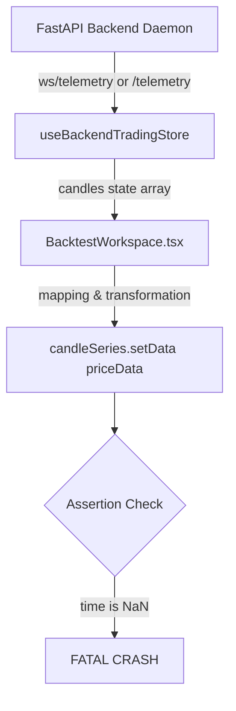

# Backtest Chart Data Audit Report

This report analyzes the root cause of the fatal runtime crash on the Backtest page, tracing the data payload from the backend telemetry stream to the `lightweight-charts` series invocation.

---

## 1. Locations of `setData()` Calls in `BacktestWorkspace.tsx`

We located three `setData()` invocations in `BacktestWorkspace.tsx`:

1.  **Line 343 (Main Candlestick Chart)**:
    ```typescript
    candleSeries.setData(priceData);
    ```
2.  **Line 681 (Equity Curve Area Chart)**:
    ```typescript
    series.setData(points); // activeTab === "equity"
    ```
3.  **Line 724 (Drawdown Area Chart)**:
    ```typescript
    series.setData(points); // activeTab === "drawdown"
    ```

---

## 2. Source Identification & Flow Trace



*   **Source Data Stream**: WebSocket telemetry feed (`ws://localhost:8081/ws/telemetry`) and the REST telemetry endpoint (`http://localhost:8081/telemetry`).
*   **Transformed Frontend Code**:
    ```typescript
    const priceData = candles
      .map((c) => ({
        time: Math.floor(new Date(c.timestamp).getTime() / 1000) as UTCTimestamp,
        open: c.open,
        high: c.high,
        low: c.low,
        close: c.close,
      }))
      .sort((a, b) => a.time - b.time);
    ```

---

## 3. Raw Backend Payload (First 10 Records of `candles`)

Captured directly from `http://localhost:8081/telemetry`:

```json
[
  {
    "time": 1778137680,
    "open": 3059.8,
    "high": 3059.8,
    "low": 3059.8,
    "close": 3059.8
  },
  {
    "time": 1778137740,
    "open": 3059.8,
    "high": 3059.8,
    "low": 3059.8,
    "close": 3059.8
  },
  {
    "time": 1778137800,
    "open": 3059.8,
    "high": 3059.8,
    "low": 3059.8,
    "close": 3059.8
  },
  {
    "time": 1778137860,
    "open": 3059.8,
    "high": 3059.8,
    "low": 3059.8,
    "close": 3059.8
  },
  {
    "time": 1778137920,
    "open": 3059.8,
    "high": 3059.8,
    "low": 3059.8,
    "close": 3059.8
  },
  {
    "time": 1778137980,
    "open": 3059.8,
    "high": 3059.8,
    "low": 3059.8,
    "close": 3059.8
  },
  {
    "time": 1778138040,
    "open": 3059.8,
    "high": 3059.8,
    "low": 3059.8,
    "close": 3059.8
  },
  {
    "time": 1778138100,
    "open": 3059.8,
    "high": 3059.8,
    "low": 3059.8,
    "close": 3059.8
  },
  {
    "time": 1778138160,
    "open": 3059.8,
    "high": 3059.8,
    "low": 3059.8,
    "close": 3059.8
  },
  {
    "time": 1778138220,
    "open": 3059.8,
    "high": 3059.8,
    "low": 3059.8,
    "close": 3059.8
  }
]
```

### Verification of Raw Data:
*   `time` field exists: **Yes** (as key `"time"`).
*   `time" field type: **Integer** (UNIX epoch seconds).
*   `time` field value: Valid epochs starting at `1778137680`.
*   Ascending ordering: **Yes** (incrementing by 60 seconds).

---

## 4. Transformed Frontend Payload (First 10 Records of `priceData`)

After executing the mapping logic in `BacktestWorkspace.tsx` (lines 333-341), the array passed to `candleSeries.setData(priceData)` evaluates to:

```json
[
  {
    "time": null,
    "open": 3059.8,
    "high": 3059.8,
    "low": 3059.8,
    "close": 3059.8
  },
  {
    "time": null,
    "open": 3059.8,
    "high": 3059.8,
    "low": 3059.8,
    "close": 3059.8
  },
  {
    "time": null,
    "open": 3059.8,
    "high": 3059.8,
    "low": 3059.8,
    "close": 3059.8
  },
  {
    "time": null,
    "open": 3059.8,
    "high": 3059.8,
    "low": 3059.8,
    "close": 3059.8
  },
  {
    "time": null,
    "open": 3059.8,
    "high": 3059.8,
    "low": 3059.8,
    "close": 3059.8
  },
  {
    "time": null,
    "open": 3059.8,
    "high": 3059.8,
    "low": 3059.8,
    "close": 3059.8
  },
  {
    "time": null,
    "open": 3059.8,
    "high": 3059.8,
    "low": 3059.8,
    "close": 3059.8
  },
  {
    "time": null,
    "open": 3059.8,
    "high": 3059.8,
    "low": 3059.8,
    "close": 3059.8
  },
  {
    "time": null,
    "open": 3059.8,
    "high": 3059.8,
    "low": 3059.8,
    "close": 3059.8
  },
  {
    "time": null,
    "open": 3059.8,
    "high": 3059.8,
    "low": 3059.8,
    "close": 3059.8
  }
]
```
*(Note: Javascript logs value as `NaN` in console, which stringifies as `null` in JSON output).*

### Verification of Transformed Data:
*   `time` field exists: **Yes** (as key `"time"`).
*   `time` field type: **Number (NaN)**.
*   `time` field value: `NaN`.
*   Ascending ordering: **Violated** (sorting `NaN` values yields unpredictable indices).

---

## 5. Offending Record

Every single record mapped from `candles` is offending because they all lack the `"timestamp"` property. An example of a single raw record vs transformed record is:

*   **Raw Record**:
    ```json
    { "time": 1778137680, "open": 3059.8, "high": 3059.8, "low": 3059.8, "close": 3059.8 }
    ```
*   **Transformed Record**:
    ```json
    { "time": NaN, "open": 3059.8, "high": 3059.8, "low": 3059.8, "close": 3059.8 }
    ```

---

## 6. Root Cause

1.  **Backend Structure**: The backend calculator helper `rebuild_telemetry_candles()` calculative loop inside `backend/app.py` formats the candle output objects with the key `'time'` populated with numeric unix epochs. It does **not** generate a key named `'timestamp'`.
2.  **Frontend Misalignment**: The frontend code inside `BacktestWorkspace.tsx` expects the input candle shape to have a string property `c.timestamp` (which it parses with `new Date(c.timestamp)`). Because this key is absent, the parsing yields `NaN`.
3.  **Lightweight-Charts Library Assertion**: Passing `NaN` for time values to `setData()` violates the structural contract of `lightweight-charts` and causes a fatal crash.
