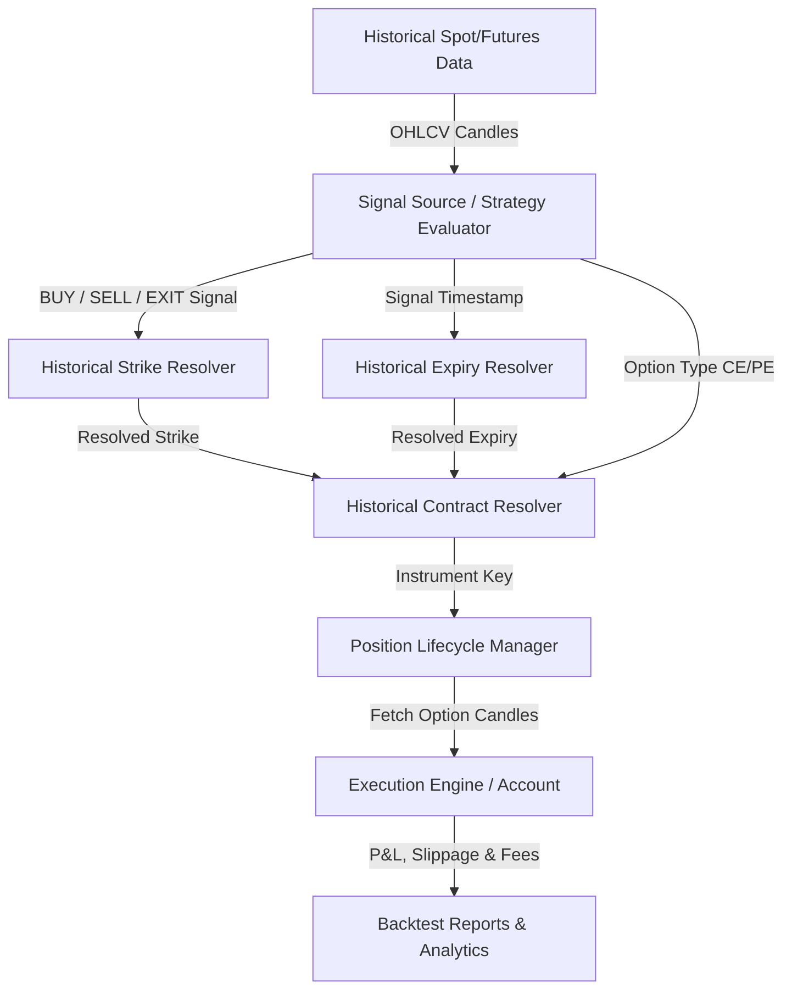
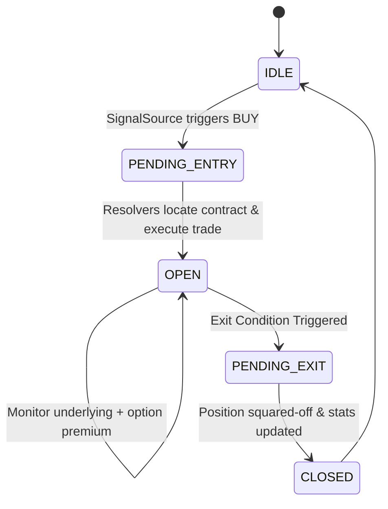

# V2 Options Backtest Engine Design
## Decoupling Signal Generation from Option Execution

This document details the architectural redesign of the Valkyrie Options Backtesting Engine (V2). The primary objective is to separate the analysis and signal generation (performed on the underlying Spot Index or Futures contracts) from the operational execution (performed on historical option contract premiums).

---

## 1. High-Level Architecture Overview

In the V1 engine, strategies evaluated option premium candles directly. This conflated market signals with options-specific structural decay and strike-level liquidity. In V2, we introduce a decoupled pipeline:



---

## 2. BacktestConfig Schema

The V2 configuration schema is designed to support modular inputs, separation of underlying instruments from execution parameters, and precise risk settings.

```python
from typing import Literal, Optional, Dict, Any
from pydantic import BaseModel, Field

class StrikeConfig(BaseModel):
    mode: Literal["ATM", "ATM+1", "ATM-1", "ATM+2", "ATM-2", "ATM+3", "ATM-3"] = "ATM"
    # Offset definition: Positive values represent higher strikes; negative represent lower strikes.
    # Ex: For NIFTY at 22000, ATM+1 CE = 22050 CE, ATM+1 PE = 22050 PE.

class ExpiryConfig(BaseModel):
    mode: Literal["CURRENT_WEEKLY", "NEXT_WEEKLY", "CURRENT_MONTHLY"] = "CURRENT_WEEKLY"
    roll_threshold_hours: float = Field(
        default=2.0, 
        description="Roll to next expiry if signal is within N hours of current expiry expiration."
    )

class RiskConfig(BaseModel):
    target_type: Literal["points", "percent", "underlying_points", "none"] = "none"
    target_value: float = 0.0
    stop_loss_type: Literal["points", "percent", "underlying_points", "none"] = "none"
    stop_loss_value: float = 0.0
    trailing_sl_gap: float = Field(default=0.0, description="Trailing gap in option premium points.")
    max_holding_candles: int = Field(default=10, description="Max candle duration to hold the position.")
    cutoff_time: str = Field(default="15:15", description="Daily intraday square-off cutoff time (HH:MM).")

class ExecutionConfig(BaseModel):
    brokerage_flat: float = Field(default=20.0, description="Flat brokerage fee per executed order (INR).")
    slippage_pct: float = Field(default=0.05, description="Slippage percentage applied to option premiums.")
    lot_size: int = Field(default=1, description="Number of lots to trade.")
    initial_balance: float = Field(default=100000.0, description="Starting test capital.")

class BacktestConfig(BaseModel):
    underlying_instrument_key: str = Field(
        ..., description="Underlying instrument key, e.g., NSE_INDEX|Nifty 50 or Futures key."
    )
    timeframe: Literal["10s", "30s", "1m", "3m", "5m", "15m", "30m"] = "1m"
    start_date: str = Field(..., description="Start date of the backtest (YYYY-MM-DD).")
    end_date: str = Field(..., description="End date of the backtest (YYYY-MM-DD).")
    
    strategy_name: str = Field(..., description="Registered strategy identifier.")
    strategy_params: Dict[str, Any] = Field(default_factory=dict, description="Strategy hyperparameters.")
    
    option_type_preference: Literal["DYNAMIC", "CE_ONLY", "PE_ONLY"] = Field(
        default="DYNAMIC", 
        description="DYNAMIC selects CE for Bullish signals and PE for Bearish signals."
    )
    
    strike_selection: StrikeConfig = Field(default_factory=StrikeConfig)
    expiry_selection: ExpiryConfig = Field(default_factory=ExpiryConfig)
    risk_management: RiskConfig = Field(default_factory=RiskConfig)
    execution: ExecutionConfig = Field(default_factory=ExecutionConfig)
```

---

## 3. Signal Source Abstraction

The Signal Source evaluates Spot or Futures charts and makes directional predictions, completely independent of options premium pricing. 

### Interface Definition
```python
import abc
import pandas as pd
from typing import Tuple, Dict, Any

class SignalSource(abc.ABC):
    @abc.abstractmethod
    def __init__(self, **kwargs):
        """Initialize strategy-specific parameters."""
        pass

    @abc.abstractmethod
    def evaluate(self, underlying_df: pd.DataFrame) -> Tuple[str, Dict[str, Any]]:
        """
        Evaluate the resampled underlying candles (Spot or Futures).
        
        Args:
            underlying_df: Historical dataframe of Spot/Futures index with columns:
                           ['timestamp', 'open', 'high', 'low', 'close', 'volume']
                           
        Returns:
            Tuple containing:
            1. signal_type: Literal["BUY", "SELL", "EXIT", "HOLD"]
            2. metadata: Dictionary with signal attributes (e.g. underlying stop_loss, direction, etc.)
        """
        pass
    
    @abc.abstractmethod
    def reset_state(self) -> None:
        """Reset internal indicators and state variables between runs."""
        pass
```

### Signal Outputs
Every evaluation must return a structured dictionary containing:
*   `signal_type`: The directional action (`BUY`, `SELL`, `EXIT`, `HOLD`).
*   `direction`: The trade direction (`BULLISH` for long underlying / buying CE, `BEARISH` for short underlying / buying PE).
*   `underlying_sl`: Structural stop-loss in the underlying asset (e.g., prior swing low).
*   `underlying_target`: Target price in the underlying asset.

---

## 4. Historical Strike Resolver

The Strike Resolver is responsible for converting the current underlying spot/futures price into a standardized, tradable strike price.

### Strike Step Sizes Map
Indian indices have rigid strike interval spacing:
| Index | Instrument Key | Strike Interval (INR) | Expiry Day |
| :--- | :--- | :--- | :--- |
| **NIFTY 50** | `NSE_INDEX\|Nifty 50` | 50 | Thursday |
| **NIFTY BANK** | `NSE_INDEX\|Nifty Bank` | 100 | Wednesday / Thursday |
| **FINNIFTY** | `NSE_INDEX\|Nifty Fin Service` | 50 | Tuesday |
| **MIDCPNIFTY** | `NSE_INDEX\|NIFTY MID SELECT` | 50 | Monday |
| **SENSEX** | `BSE_INDEX\|SENSEX` | 100 | Friday |
| **BANKEX** | `BSE_INDEX\|BANKEX` | 100 | Monday |

### ATM Strike Resolution Logic
```python
def resolve_atm_strike(spot_price: float, step: int) -> float:
    return round(spot_price / step) * step
```

### Offsets Mapping Logic
The offset defines how many strike steps to shift from the At-The-Money (ATM) strike. In V2, we adopt a directional offset system:
*   `ATM`: Offset $n = 0$.
*   `ATM+1` (Higher Strike): Offset $n = +1$.
*   `ATM-1` (Lower Strike): Offset $n = -1$.
*   `ATM+2` / `ATM-2`: Offset $n = \pm 2$.
*   `ATM+3` / `ATM-3`: Offset $n = \pm 3$.

$$\text{Resolved Strike} = S_{\text{ATM}} + (n \times \text{Step})$$

#### Option Type Strike Mapping:
*   **CE Options (Call)**:
    *   ATM ($n = 0$): At-The-Money.
    *   ATM+1 ($n = +1$): Out-of-the-Money (OTM) — Cheaper, higher strike.
    *   ATM-1 ($n = -1$): In-the-Money (ITM) — More expensive, lower strike.
*   **PE Options (Put)**:
    *   ATM ($n = 0$): At-The-Money.
    *   ATM+1 ($n = +1$): In-the-Money (ITM) — More expensive, higher strike.
    *   ATM-1 ($n = -1$): Out-of-the-Money (OTM) — Cheaper, lower strike.

---

## 5. Historical Expiry Resolver

The Expiry Resolver finds the correct contract expiration date relative to the signal timestamp by looking at the instrument registry.

### Algorithm Flow
1.  **Extract All Expiries**: Query the master database (`nifty_options.csv` or DB equivalent) for the selected index name and extract all unique expiries.
2.  **Filter and Sort**: Keep only expiry dates that are greater than or equal to the signal timestamp ($\text{Expiry} \ge t_{\text{signal}}$). Sort them in chronological order.
3.  **Apply Expiry Mode**:
    *   `CURRENT_WEEKLY`: Select the closest chronological weekly contract (`weekly == 1.0` or the first available expiry date).
    *   `NEXT_WEEKLY`: Select the second closest chronological weekly contract.
    *   `CURRENT_MONTHLY`: Select the closest contract classified as monthly (typically `weekly == 0.0` or occurring on the last Thursday of the current calendar month).
4.  **Roll Threshold Handling**:
    If the signal time $t_{\text{signal}}$ is close to the current weekly contract's expiration time (defined by `roll_threshold_hours` in config, e.g., 2 hours before 15:30 on expiry day), automatically roll execution to the `NEXT_WEEKLY` expiry contract to avoid extreme delta swings and illiquidity.

---

## 6. Historical Contract Resolver

Once the Expiry Date, Strike Price, Option Type (CE/PE), and Exchange Segment are resolved, the Contract Resolver fetches the unique Upstox transaction code (`instrument_key`).

### Lookup Logic
```python
def resolve_contract(
    index_name: str, 
    strike_price: float, 
    expiry_date: str, 
    option_type: str, 
    segment: str = "NSE_FO"
) -> str:
    """
    Looks up nifty_options.csv or instruments DB to retrieve instrument_key.
    
    Query Logic:
      SELECT instrument_key, lot_size 
      FROM instruments 
      WHERE name = index_name 
        AND strike_price = strike_price 
        AND expiry_date = expiry_date 
        AND instrument_type = option_type
        AND segment = segment
    """
    pass
```

### Safety and Error Handling
*   **Strike Cap Checks**: If the resolved strike is not available in the historical CSV (due to extreme market gap-downs/gap-ups where exchanges hadn't opened those strikes), round to the closest active strike.
*   **Expired Contracts Safety**: Upstox REST APIs do not support fetching historical candles for expired option contracts directly via standard public endpoints. The resolver must query from a localized compressed historical tick/candle database or fallback to simulated option prices if the target premium contract is missing.

---

## 7. Position Lifecycle

The V2 position lifecycle tracks both the option premium contract and the underlying asset concurrently to govern entry and exit conditions.



### State Machine Details
1.  **IDLE**: The backtest replayer loops through underlying Spot/Futures candles.
2.  **PENDING_ENTRY**: A signal triggers. Resolvers compute Strike, Expiry, Option Type, and fetch the option contract's historical tick data.
3.  **OPEN**:
    *   **Option Buy Execution**: Entry is recorded at the option candle close (or tick) plus the configured slippage percentage.
    *   **Lot Sizing**: Dynamic lot sizing translates contracts to quantity using the lot size valid on that historical date.
4.  **Monitoring (Dual-Pricing Check Loop)**:
    For every step in the backtest (candle or tick replay), the engine evaluates:
    *   *Condition A*: Does the Spot/Futures price touch the `underlying_sl` or `underlying_target`?
    *   *Condition B*: Does the Option Premium touch the premium-based `stop_loss_value` or `target_value`?
    *   *Condition C*: Has the position duration reached `max_holding_candles`?
    *   *Condition D*: Has the daily time reached the session `cutoff_time` (e.g., 15:15)?
    *   *Condition E*: Has the `SignalSource` issued an explicit `EXIT` signal?
5.  **PENDING_EXIT**: If any condition from (A, B, C, D, E) is met, trigger exit logic.
6.  **CLOSED**: Exit trade. Apply transaction fee and slippage. Save trade log, update session balance, and return to `IDLE` state.

---

## 8. Timeframes and Resampling

V2 supports granular backtesting configurations, handling timeframes from 10 seconds to 30 minutes.

### Supported Resolutions
*   **Sub-Minute**: `10s`, `30s`
*   **Standard Intraday**: `1m`, `3m`, `5m`, `15m`, `30m`

### Resampling Strategy
*   **Spot/Futures Underlying**: Sourced from raw 1-minute historical candles (or tick data) and resampled using pandas:
    ```python
    df.resample('30S', on='timestamp').agg({
        'open': 'first',
        'high': 'max',
        'low': 'min',
        'close': 'last',
        'volume': 'sum'
    }).dropna()
    ```
*   **Sub-minute Simulation (10s/30s)**:
    Since Upstox APIs do not store historical sub-minute candle databases, sub-minute testing requires:
    1.  **Direct tick files (L3 data)**: Replaying historical order-book logs if archived.
    2.  **Intraday Candle Simulators**: Synthesizing sub-minute movements inside a 1-minute candle by replaying standard path intervals (Open $\rightarrow$ Low $\rightarrow$ High $\rightarrow$ Close for green candles).

---

## 9. Data Requirements from Upstox

To run V2 backtesting locally without network bottlenecks, the following datasets are required:

### 1. Underlying Spot/Futures History
*   **Data Type**: 1-minute OHLCV historical bars.
*   **Upstox Endpoint**: `/v2/historical-candle/{instrument_key}/{interval}/{to_date}/{from_date}`
*   **Keys**: `NSE_INDEX|Nifty 50` (Nifty Spot), `NSE_INDEX|Nifty Bank` (BankNifty Spot).

### 2. Historical Option Instrument Directory
*   A localized SQLite database or continuous CSV directory (`nifty_options.csv` expanded historically) mapping expired option contracts.
*   **Fields**: `instrument_key`, `name`, `strike_price`, `expiry`, `instrument_type`, `lot_size`, `weekly`.

### 3. Expired Option Premium Data
*   **Data Type**: Historical 1-minute candles for all strikes within $\pm 10$ steps of ATM during the backtest timeframe.
*   *Note*: Since expired contract historical candles are archived on Upstox, they must be pre-fetched, cached, and stored locally. A local cache database (`valkyrie_options_cache.db`) is recommended to avoid live rate-limit throttling during backtests.

---

## 10. Migration Plan from V1 Engine

To upgrade the current engine to the V2 design without breaking existing dependencies, follow these steps:

### Step 1: Strategy Restructuring
Decouple `Strategy` classes in `backend/strategy_heikin_ashi_gar.py` into:
1.  **`SignalStrategy`**: Takes Spot index candles, calculates indicators (HA, EMA, ATR), and outputs directional signals (`BUY`, `SELL`, `EXIT`, `HOLD`).
2.  **`ExecutionManager`**: Responsible for contract resolution and order placement.

```diff
- class HeikinAshiGarStrategy(Strategy):
-     # Analyzed option chart closing prices directly
-     def evaluate(self, raw_df: pd.DataFrame) -> tuple:
-         ...

+ class HeikinAshiGarSignalStrategy(SignalSource):
+     # Analyzes Spot Index (NIFTY 50) and returns underlying targets
+     def evaluate(self, underlying_df: pd.DataFrame) -> Tuple[str, Dict[str, Any]]:
+         ...
```

### Step 2: Extract Resolvers
Create a new file `backend/resolvers.py` containing:
*   `class HistoricalStrikeResolver`
*   `class HistoricalExpiryResolver`
*   `class HistoricalContractResolver`

### Step 3: Implement V2 Replay Loop in `app.py`
Refactor `run_historical_backtest()` in `app.py`:
1.  Load historical underlying Spot data.
2.  Instantiate `SignalStrategy`.
3.  Replay underlying candles sequentially.
4.  On `BUY` signal:
    *   Call `StrikeResolver` $\rightarrow$ strike.
    *   Call `ExpiryResolver` $\rightarrow$ expiry.
    *   Call `ContractResolver` $\rightarrow$ `instrument_key`.
    *   Fetch option candles for the resolved `instrument_key` starting from the signal timestamp.
    *   Trigger position entry.
5.  On subsequent candles:
    *   Check underlying price against stops.
    *   Check option candle prices against option stops.
    *   On trigger: exit, calculate PnL, close position, and resume Spot scanning.

### Step 4: Dual-Engine Safe Deployment
Introduce an `engine_version` field in the `/start` payload. If `engine_version == "v2"`, execute the new pipeline; otherwise, fall back to the V1 code path. This ensures continuous backward compatibility for older frontend dashboards.
